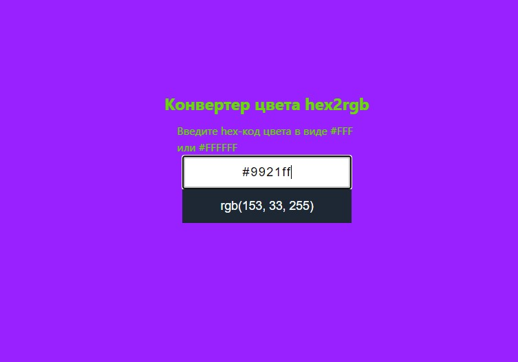

# Конвертер цветов из HEX в RGB

[вернуться в корневой readme](../README.md)

- [Задание](#задание)
- [Решение](#решение)

## Задание

Вам необходимо разработать конвертер цветов из HEX в RGB.  

### Интерфейс конвертера
При правильном вводе цвета он показывает его представление в формате RGB и меняет цвет фона на заданный:  

Конвертер при вводе неправильного цвета в формате HEX должен сообщать об ошибке:

Необходимо дожидаться ввода всех семи символов, включая решётку, чтобы принимать решение о том, показывать ошибку или менять цвет фона.

[Вверх](#top)

## Решение

Добавил сам себе условие - HEX-код может быть как полным (из 6 символов, #AABBCC), так и в сокращенной записи (из 3 символов, #bad).  

Изначально прочитал задание не до конца, поэтому в компоненте много избыточного кода.  
История действий: 
- на элемент input добавил встроенный валидатор, ограничил максимальную длину ввода в 7 символов;
- в форму добавил скрытый input с типом submit (чтобы по нажатию Enter ловить событие) и на элемент формы повесил обработчик onSubmit;
- и только после прочтения задания целиком на элемент input повесил обработчик onInput.

В onSubmit посмотрел, как ловить атрибуты формы через FormData.  
Поучился типизировать event - оказывается, в Реакте событие event от элемента имеет тип не какой-то обобщенный Event.

По-хорошему, надо бы еще в onInput debounce добавить, но так как приложение ни к какому api не обращается, то отсутствие дебаунсера некритично.

У текста в заголовке и у надписи применен стиль инвертирования цвета относительно фона.

Скриншот исходного состояния  

Скриншот с полным корректным HEX-кодом  

Скриншот с коротким корректным HEX-кодом  

Скриншот с некорректным HEX-кодом  

[Вверх](#top)