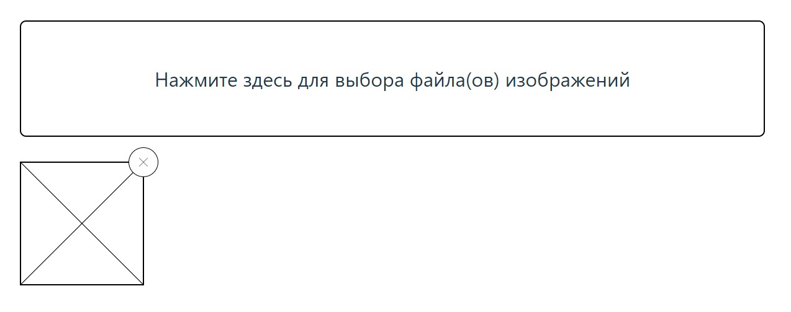
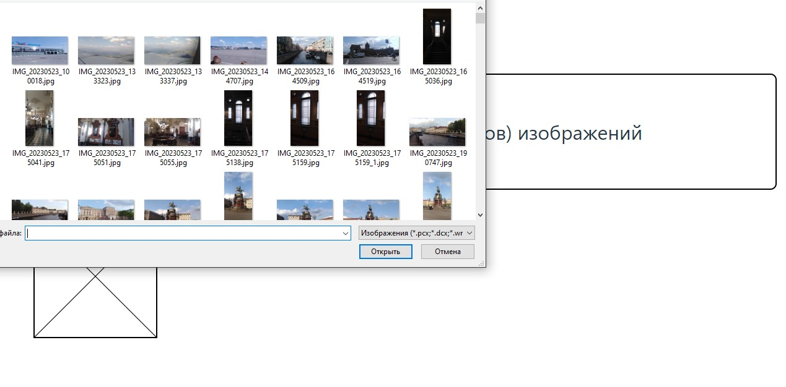
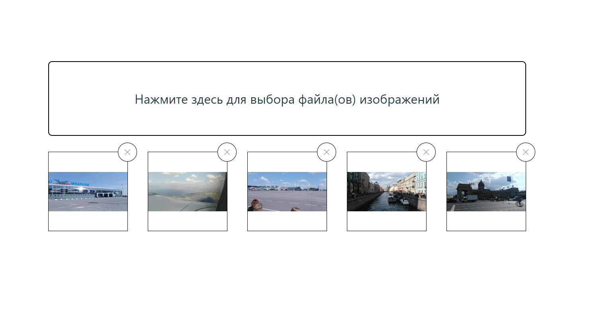

# <a name="top"></a>
# Менеджер фото
  
[вернуться в корневой readme](../README.md)


- [Задание](#задание)
- [Решение](#решение)

## Задание

Вы решили модернизировать один из старых проектов и переписать его в виде React-компонентов:  


### Интерфейс Менеджера фото
При клике на области «Click to select» должно появляться стандартное окно выбора файлов операционной системы, в котором пользователь может выбрать один или несколько файлов изображений (image/*).

После выбора файлов они автоматически загружаются и отображаются в виде preview фиксированного размера (нижний блок). Для отображения используйте DataURL. Новые файлы должны добавляться, а не заменять предыдущие.

При клике на крестик, изображение и все связанные с ним данные должны удаляться.

Важно: Drag & Drop реализовывать не нужно.

### Подсказки
1. Разместите с помощью CSS блок "Click to select" над <input type="file" /> и установите этому блоку pointer-events: none;, чтобы вызывать окошко выбора файлов при клике.
2. Используйте следующую заготовку для получения DataUrl:
```js
const fileToDataUrl = file => {
  return new Promise((resolve, reject) => {
    const fileReader = new FileReader();
  
    fileReader.addEventListener('load', evt => {
      resolve(evt.currentTarget.result);
    });
    
    fileReader.addEventListener('error', evt => {
      reject(new Error(evt.currentTarget.error));
    });
    
    fileReader.readAsDataURL(file);
  });
}

const handleSelect = async (evt) => {
    const files = [...evt.target.files];
    const urls = await Promise.all(files.map(o => fileToDataUrl(o)));
    // У вас в массиве - dataUrl, можете использовать в качестве значения атрибута src тега img
}
```

[Вверх](#top)


## Решение

Реализовано:
- для работы с данными используется хук useState
- у приложения есть область, кликнув на которую, можно выбрать один или несколько файлов формата изображений
- после выбора изображение добавляется в область предпросмотра, последующий выбор добавляет изображения в список
- у каждого блока изображения есть кнопка, позволяющая удалить элемент из списка
- при пустом списке изображений отображается "изображение-заглушка"

Начальный вид приложения:  


Процесс выбора изображения:  


Приложение с несколькими изображениями:  



[Вверх](#top)