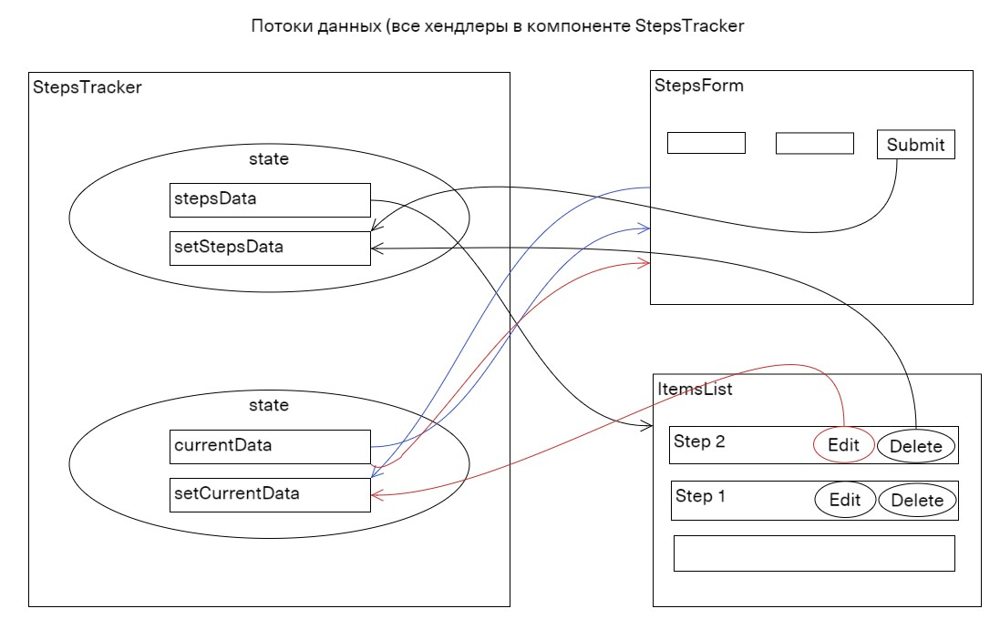

# <a name="top"></a>
# Учёт тренировок

[вернуться в корневой readme](../README.md)


- [Задание](#задание)
- [Решение](#решение)

## Задание

Вы решили реализовать небольшое приложение, которое хранит данные о тренировках и прогулках, которые вы совершаете в течение недели.

Общий интерфейс должен выглядеть следующим образом:  


### Добавление данных
У вас должна быть форма ввода, в которую вводится дата и количество пройденных километров. Новые значения добавляются в таблицу при отправке формы.

*Особенности добавления:*
1. Новые значения добавляются не в конец, а согласно сортировке по дате, то есть если мы добавим 21.07.2019, то значение встанет на первую позицию, согласно скриншоту, а если 17.07.2019 — то на последнюю.
2. Если мы добавляем значения, указывая уже существующую дату, то значения суммируются с теми, что хранятся в таблице, например, если добавить 20.07.2019 и 10 км, то для даты 20.07.2019 будет отображаться 15.7 км.

### Удаление данных
С помощью иконки ✘ должна быть возможность удалить строку. Удаляется вся строка целиком и данные, связанные с ней.

### Редактирование данных
Дополнительное, необязательное задание: вы можете реализовать кнопку редактирования ✎, при нажатии на которую происходит перенос данных в форму ввода с последующим сохранением при нажатии кнопки Ok.


[Вверх](#top)


## Решение

Реализовано:
- приложение, позволяющее выбирать дату и вводить количество шагов
- средствами HTML поля даты и количества шагов сделаны обязательными и ограниченными по формату ввода (минимальное значение километража - 0.1)
- записи выводятся в порядке от новой к старой дате
- у введенных записей есть функционал изменения и удаления
- при повторной выборе даты значение пройденных километров в добавленной записи суммируется с ранее введенным значением. 
- таблица с записями ограничена по высоте, при определенном количестве записей появляется полоса прокрутки  
- базовый адаптив

Макет с логикой движения данных:


В ТЗ не хватает юзер-кейса очистки полей ввода - юзер выбрал режим редактирования, но передумал обновлять запись.


То, что на первый взгляд казалось "ещё одной todo'шкой" и казалось легко декомпозируемым на управляемую форму и неуправляемый список, стало "пранком, вышедшим из под контроля".  
В родительском компоненте появилось два стейта.  
Первоначальная идея отдавать из компонента формы объекта в виде FormData, перестала быть целесообразной, у объекта FormData есть неприятное свойство собирать данные только с "включенных" элементов (из элементов с атрибутом disabled или input:checkbox c атрибутом checked=false данные не идут в форму), пришлось использовать метод append() для добавления необходимых данных.  
Вдобавок для TypeScript объект типа FormData слишком неявный.

В ES2023 появился метод массива toSorted, не изменяющий исходный массив, но для этого придется копаться в tsconfig.app.json:
```json
{
  "compilerOptions": {
    "lib": "ES2023"
    }
}
```
или даже 
```json
{
  "compilerOptions": {
    "lib": ["ESNext", "dom", "dom.iterable"],
    }
}
```
Stuff: "TypeScript: Раскладываем tsconfig по полочкам. Часть 1" - https://habr.com/ru/articles/542234/  
Но можно получиться и так - "Tsconfig.json lib option “es2023” not supported by sonar-scanner" 

[Вверх](#top)
